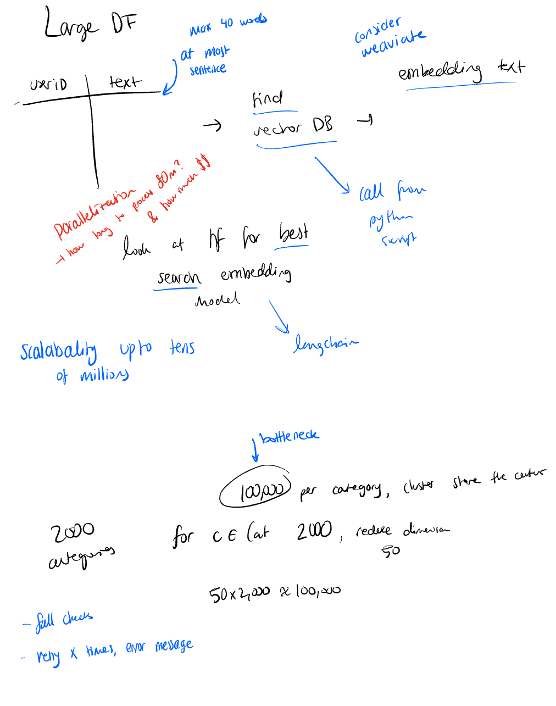

# Week 1

#### Goals:
- Find vedctor DB to store `userID, text` data table
    - Consider a few options
    - Look for the best vector DB, consdier weaviate vector DB
    - specs: 
        - needs to support up to 80M embeddings
        - needs to have semi fast lookup
        - needs to not be stupidly expensive
    - create python script to call the DB from
- Find embedding model
    - consider a few options
    - look at HF for best embedding model for recommendation systems/search
    - use langchain for setup
    - specs:
        - must support >60 tokens (~40 words)
        - 1500+ dimensions
        - ideal for search

### To Use Script:
``` bash
# in root
python -m venv .venv

source .venv/bin/activate

pip install -r requirements.txt

cd week1

# Create a .env file from the example
cp .env.example .env

# Edit the .env file to add your MongoDB password
# Replace <your_mongodb_password> with your actual password

python -m database.py
```


----
# Research Findings:

### Vector Database Solutions
Rough estimate for GB requirements: $ \text{memory size} = \text{number of vectors} \times \text{vector dimension} \times 4 \text{ bytes} \times 1.5 $. For 80M vectors of ~1500 dimensions, $\text{memory size} = 720\text{GB}$

PostgreSQL with pgvector is the most cost-effective vector DB for large-scale applications.


**MongoDB Atlas Vector Search:**
Cost is roughly \$0.98/hr (\$715/mo) given requirements.

**AWS:**
AWS Marketplace, a pre-configured PostgreSQL 16 with pgvector extension can be deployed for as little as \$0.292 per hour (~\$215 per month) using a recommended `t3.medium` instance.

**PostgreSQL with pgvectorscale vs. Pinecone:**
When compared to Pinecone's storage-optimized index, PostgreSQL with pgvector and pgvectorscale achieves 28x lower p95 latency and 16x higher query throughput for approximate nearest neighbor queries at 99% recall8. Even when compared against Pinecone's performance-optimized index, PostgreSQL with pgvectorscale delivers 1.4x lower p95 latency and 1.5x higher query throughput6.

#### Implementation Considerations
To optimize PostgreSQL with pgvector for tens of millions of high-dimensional vectors, consider the following:
- Proper indexing: Use appropriate indexing methods such as IVF_FLAT or HNSW to balance between search accuracy and performance16.
- Hardware sizing: Ensure sufficient memory and CPU resources for your specific workload.
- Consider pgvectorscale: This extension significantly improves performance for large-scale vector workloads through innovations like StreamingDiskANN and Statistical Binary Quantization6.
- Vector dimensionality: For vectors around 1500 dimensions (similar to OpenAI's 1536-dimensional embeddings), be aware that approximately 6GB of storage is needed per million vectors10.


### Embedding Models

#### HuggingFace Models ([MTEB leaderboard](http://mteb-leaderboard.hf.space/?benchmark_name=MTEB%28eng%2C+v2%29))
- Various embedding models available

| Model | Parameter Size| Dimensions | Token Limit | Performance MTEB | Cost | 
|-------|---------------|------------|-------------|------|------|
multilingual-e5-large-instruct | 560M | 1024 | 512 | 84.72% | ?
GIST-large-Embedding-v0 | 335M | 1024 | 512 | 84.44% | ?
mxbai-embed-large-v1 | 335M | 1024 | 512 | 84.42% | ?
text-embedding-3-small | Unknown | 1536 | 8191 | 81.4% | $0.02/1M tok

Time estimate: 200K toks/hour with HF models, ~900K toks/hour on OpenAI.
Cost estimate: \$80 for 80M vectors w/ OpenAI
<small>*using AWS g4dn.xlarge</small>

----

## Original Discussion:




#### Meeting Takeways:
- go with OpenAI for embeddings
- Prepare first version of vector DB: MongoDB Atlas Vector Serach--they can always move it
- when build own weviate, move there
- Local AWS account access sent on Sunday
- Prepare MongoDB database, S3 or Nautilus DB
- Explain structure Monday
- Tuesday midday setup ready
- Calculate embeddings for all the data by Friday/Saturday 
- Code review while working next week
- Tomorrow:
    - Experimental AWS account
- Tuesday Midday:
    - Start calculating embeddings
    - Beware of the cost
- Start with small dataset making sure you are not losing a lot of data
- Find some way to do this properly
    - Difficult to prevent this data leakage
- Make sure everything is working concurrently
- Plan to charge full-time until you start your internship
    - 10/hrs week
    - Prepare an invoice with ChatGPT and send to Kimon
    - On the 5th of every month, charge for the whole month
    - One sentence memo each month, line items
    - $1,600/mo
    - SEND DRAFT

Misc:
- kimon willing to talk to my parents
- Do it only ***IFF*** you believe in the vision, team, & purpose OF THE COMPANY
    - entreprenuers are trained to sell
